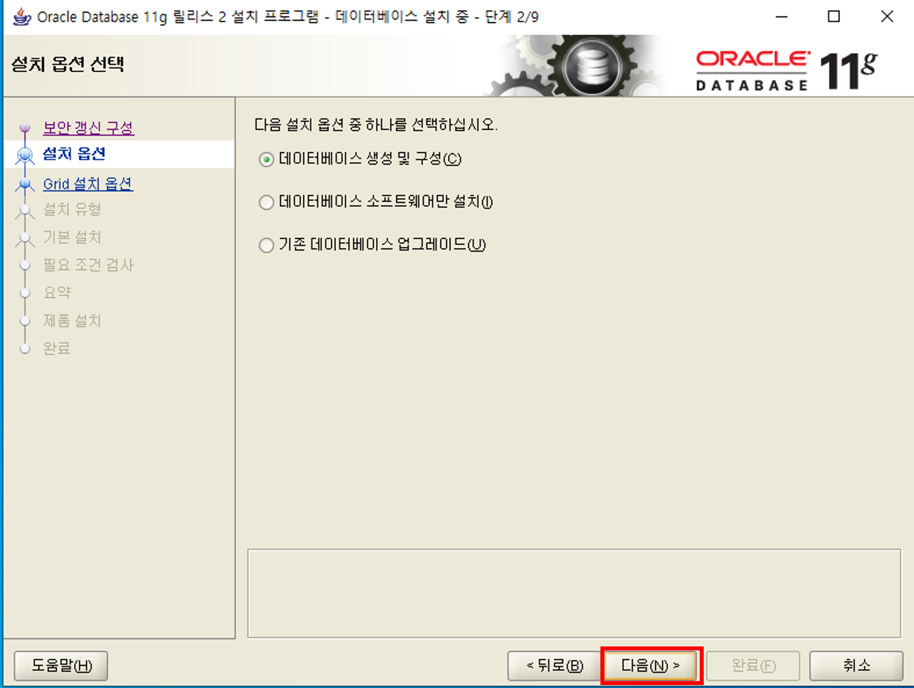

## <VM ware 등록 후 (D드라이브 생성) 오라클 설치 후 처리>

### 1. VM images 등록

### 2. 생성된 vm 디스크 용량 확장

#### 2-1 SCSI 확장 크기 입력 후 생성

### 3. 내컴퓨터 > 관리> 디스크 관리 > 생성한 드라이브 문자 및 경로 변경

### 4. 오라클 설치

## 5.오라클 셋팅

#### 5-1 SQL Plus 실행
오라클을 설치하면 SQL Plus가 만들어지는데 접속이 잘 되는지 먼저 확인한다.

#### 5-2 cmd창에서 아이피와 호스트이름 확인

#### 5-3 오라클 설정파일 수정

D:\product\11.2.0\dbhome_1\NETWORK\ADMIN 경로에 listener.ora 와 tnsnames.ora 파일을 열어서 localhost 부분을 5-2에서 확인 호스트 이름으로 변경해준다.

#### 5-4 sqldeveloper 실행 후 셋팅

#### 5-5 DB정보 입력

오라클 설치할 때 설정한 정보를 입력하고 하단에 테스트 버튼을 눌러서 접속이 잘 되었는지 확인한다.
(호스트 이름은 localhost 또는 5-2에서 확인한 ip를 적어준다.)

## <외부PC → VM에 설치한 oracle DB IP에 접근> 

### 6. 고급 보안이 포함된 방화벽 처리

#### 6-1 인바운드 규칙 등록

#### 6-2 인바운드 규칙 등록

#### 6-3 인바운드 규칙 등록

### 6.VM setting > network adapter > Bridged로 선택 되어 있는지 체크

